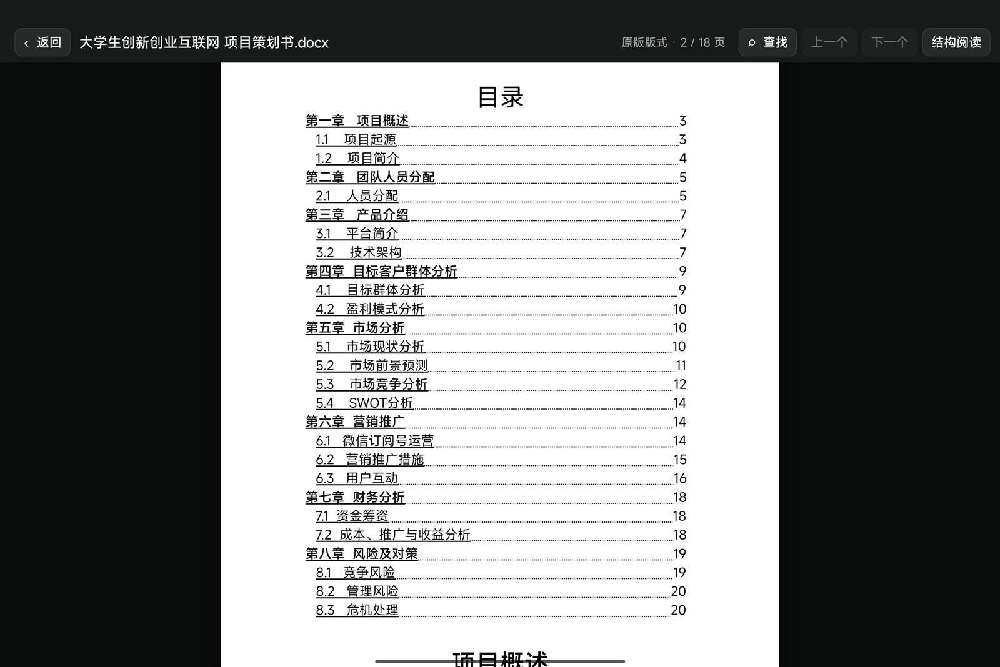
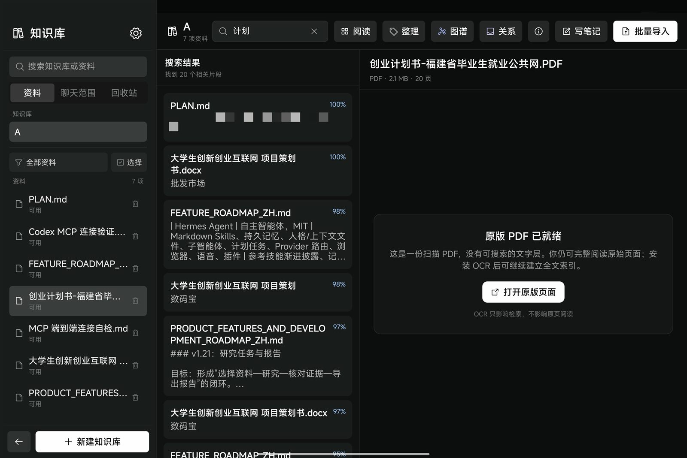
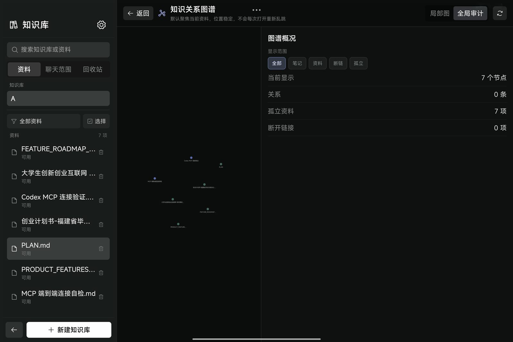

<p align="center"></p>

<h1 align="center">Velaryn</h1>
<p align="center"><strong>Knowledge, in motion.</strong></p>
<p align="center">面向 Android 平板的本地优先 AI 知识库与智能体工作台。</p>

<p align="center">
  <a href="https://velaryn.cn/">官方网站</a> ·
  <a href="https://velaryn.cn/download/">下载 Beta</a> ·
  <a href="https://velaryn.cn/docs/">使用文档</a> ·
  <a href="https://velaryn.cn/roadmap/">路线图</a> ·
  <a href="https://github.com/Nobel-BY/velaryn/issues">反馈问题</a>
</p>

> 当前版本：**v0.9.5 Beta** · Android 12+ · ARM64 · 横屏平板优先。Beta 阶段请为重要资料保留独立备份。

## Velaryn 是什么

Velaryn 不把资料当成聊天附件。它把文档阅读、知识组织、混合检索、可核查引用、关系图谱和智能体任务连接成一条可沉淀的工作流：

```text
导入资料 → 原版/结构化阅读 → 本地检索 → 核查来源
         → 智能体研究 → 带引用结果 → 确认后写回知识库
```

- **本地优先知识库**：原文件、索引、笔记和关系默认保留在 Android 设备。
- **PDF / DOCX 阅读**：原版分页与结构化文本并存，兼顾阅读、查找和引用。
- **混合检索**：关键词与语义召回协同；本地嵌入不可用时透明降级。
- **可核查引用**：关键结论可返回原始文档、页码或段落。
- **Markdown 知识网络**：双链、反链、未链接提及与知识图谱健康审计。
- **知识协同智能体**：多轮检索、冲突检查、任务进度与来源可见。
- **受控知识写入**：创建笔记、标签或关系前默认预览确认。
- **MCP 知识桥**：经过授权的外部 AI 客户端可检索平板知识库并创建笔记。

## v0.9.5 Beta 新增

- **网页正文剪藏**：从浏览器分享到 Velaryn 后，在隔离 WebView 中提取正文并清理导航、广告、推荐、表单和脚本噪声，同时保存 Markdown 与无脚本 HTML 快照。
- **可靠收集箱**：展示抓取中、可入库和失败状态，支持预览、重试、仅保存链接、规范化 URL 去重，以及批量入库和忽略。
- **主动阅读工具条**：在 PDF、DOCX、Markdown 和纯文本中使用摘录、解释、翻译、提问、笔记、建链和制卡七种操作。
- **结果可追溯**：派生笔记记录原资料、版本与精确锚点，可一键跳回来源；AI 结果先预览、可编辑，再保存为独立 Markdown 笔记。
- **阅读连续性**：保存阅读位置、显示进度并提供最近阅读筛选；已在 Android 16 平板完成覆盖安装、真实网页剪藏与来源跳转验收。

v0.9.4 已先行交付 Android 系统分享、持久化知识收集箱和来源可追溯摘录；v0.9.5 将这条路径扩展为完整的网页剪藏与主动阅读闭环。

完整内容见 [CHANGELOG.md](CHANGELOG.md) 和官网 [更新日志](https://velaryn.cn/changelog/)。

## v0.9.3 Beta 新增

- **检索回归集**：保存真实问题、期望来源和无依据判定，支持 JSON 导入导出与已保存/草稿配置 A/B 报告。
- **检索质量增强**：可选查询改写、多查询召回、父子上下文和模型 API 重排，并显示耗时、排名变化、理由与安全回退原因。
- **统一安全写入**：Agent 与 MCP 修改 Markdown 笔记时使用同一版本化协议，单篇和批量变更都先展示逐行 Diff。
- **并发与恢复**：旧版本修改不会覆盖新版本；每次写入保留幂等键、审批和操作审计，历史版本恢复会生成新的可追踪版本。
- **真机验收**：已在 Android 16 ARM64 平板完成真实模型增强和 MCP 创建、更新、冲突、批量与恢复流程验证。

完整内容见 [CHANGELOG.md](CHANGELOG.md) 和官网 [更新日志](https://velaryn.cn/changelog/)。

## v0.9.2 Beta 新增

- **创作空间**：独立管理项目规则、任务、产物、代码、版本和预览记录，不再把项目文件混在聊天工作区里。
- **平板项目工作台**：支持空白静态 Web 项目、ZIP 导入导出、文件树、全文搜索和轻量编辑。
- **安全修改与恢复**：智能体提出多文件 Patch 后先展示差异，确认后才写入；修改前自动创建 Checkpoint，失败时回滚。
- **隔离预览与元素点选**：在 WebView 中预览网页原型，收集控制台和资源错误，并可点选元素为智能体提供精确上下文。
- **研究工作流**：提供 `/研究`、`/比较`、`/学习计划`、`/整理` 和 `/原型规划`，支持用 `@资料`、`@知识库` 明确限定上下文，并保留证据轨迹。

完整内容见 [CHANGELOG.md](CHANGELOG.md) 和官网 [更新日志](https://velaryn.cn/changelog/)。

## 产品截图

| 原版文档阅读 | 混合检索与原文 |
| --- | --- |
|  |  |



## 快速开始

1. 从 [velaryn.cn/download](https://velaryn.cn/download/) 下载官方 APK。
2. 安装前核对官网提供的 SHA-256。
3. 创建知识库，先导入 5–20 份 PDF、DOCX、Markdown 或 TXT。
4. 在设置中配置你自己的模型 API。
5. 从精确搜索、引用跳转和选定资料研究开始试用。

更完整步骤见 [GETTING_STARTED.md](docs/GETTING_STARTED.md)。

## 数据边界

- 知识库检索在平板本地完成。
- 调用云端模型 API 时，只发送当前任务需要的上下文片段。
- 智能体写入默认需要确认；自动写入必须由用户主动开启。
- 密钥、安全令牌和私人资料不应出现在公开 Issue 中。

详见 [隐私与安全说明](docs/PRIVACY_AND_SECURITY.md) 与官网 [安全页](https://velaryn.cn/security/)。

## 仓库范围

这是 Velaryn 的**公开产品仓库**，用于：

- 产品介绍与公开文档；
- Beta 版本进展和已知边界；
- 缺陷报告与功能建议；
- 官方网站和下载入口的可信关联。

本仓库不等同于应用完整源代码仓库，也不表示仓库内所有内容均以开源许可证发布。参见 [REPOSITORY_SCOPE.md](REPOSITORY_SCOPE.md)。

## 来源与致谢

Velaryn 基于 [Mintplex-Labs/anythingllm-mobile](https://github.com/Mintplex-Labs/anythingllm-mobile)（MIT License）进行深度定制。原始版权和 MIT 许可文本见 [THIRD_PARTY_NOTICES.md](THIRD_PARTY_NOTICES.md)。AnythingLLM 与 Mintplex Labs 不对 Velaryn 的定制版本提供背书或支持。

## 参与反馈

- 遇到缺陷：使用 [Bug report](https://github.com/Nobel-BY/velaryn/issues/new?template=bug_report.yml)
- 提交建议：使用 [Feature request](https://github.com/Nobel-BY/velaryn/issues/new?template=feature_request.yml)
- 安全问题：请先阅读 [SECURITY.md](SECURITY.md)，不要公开漏洞利用细节。

---

<p align="center">© 2026 Velaryn · Public Beta</p>
